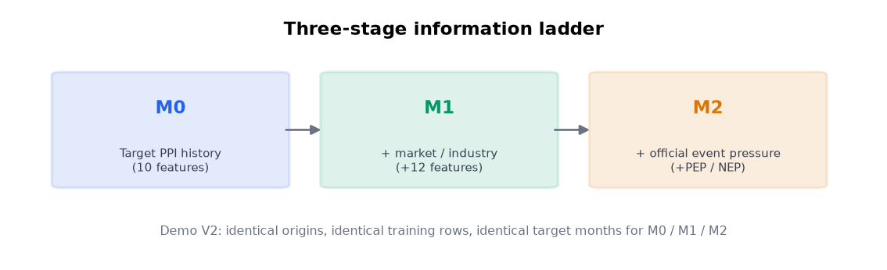
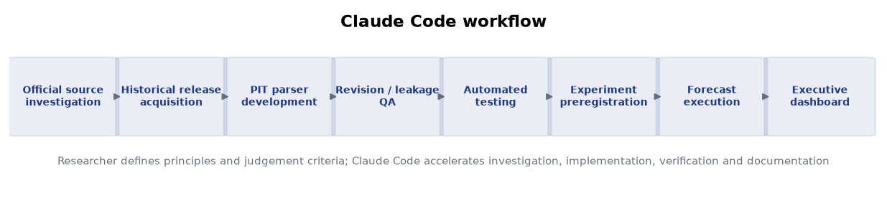

# 철스크랩 가격 예측 — Clean-PIT Forecasting Demo

> **각 과거 시점에 실제로 공개되어 있던 정보만 사용해서 예측했습니다.**
> 무료 공개 데이터 · CPU only · 사전등록된 실험.

이 저장소는 **발표용 결과 저장소**입니다. 연구 파이프라인은 별도의 로컬 저장소에서
실행되며, 여기에는 사전 계산된 안전한 산출물만 들어 있습니다.

---

## 한눈에 보기

| | |
|---|---|
| 예측 대상 | **WPU1012** — 공개 철스크랩 가격지수 (US BLS PPI) |
| 설명변수 | Clean-PIT 6개 계열 → 12개 파생 지표 |
| 평가 시점 | **50개** (2021-11-30 ~ 2025-12-31) |
| 자동 테스트 | **704개** |
| 공식 사건 | **9건** (전부 정부/공식기관 출처) |
| FRED/ALFRED 의존 | **0** |
| 사전등록 | **YES** — 결과를 보기 전에 규칙 고정 |
| 실행 커밋 | `6c34fcec308a` |

---

## 3단계 모델 구조



| 모델 | 입력 | 지위 |
|---|---|---|
| **N0** | 가장 최근 발표값 그대로 | 기준선 |
| **M0** | 과거 가격 이력 10개 | 공식 · 사전등록 |
| **M1** | M0 + 시장/산업 데이터 12개 | 공식 · 사전등록 |
| **M2** | M1 + 공식 사건 압력 2개 | ⚠️ **탐색적 Demo** |

---

## 결과 (primary target WPU1012)

| 모델 | MAE | RMSE | 지위 |
|---|---|---|---|
| N0 | 50.32 | 69.40 | 공식 · 사전등록 |
| M0 | 49.19 | 76.20 | 공식 · 사전등록 |
| M1 | 50.75 | 80.77 | 공식 · 사전등록 |
| M2_DEMO | 62.06 | 90.99 | ⚠️ 탐색적 Demo |


### 사전등록된 주요 가설

> **H0:** 시장·산업 데이터를 추가한 M1 은 과거 가격만 쓰는 M0 대비 절대예측손실을
> 개선하지 않는다.

**결과: H0 를 기각하지 못했습니다.** 상대 개선 **-3.2%**, DM 검정 p = **0.727**,
95% 신뢰구간이 0을 포함합니다.

결과가 기대와 달랐지만 **사전에 고정한 모델·기간·지표를 바꾸지 않았습니다.**
그것이 사전등록의 목적입니다. 지금 얻은 것은 "이 조건에서는 개선되지 않는다"는
재현 가능한 출발점입니다.


---

## 공식 사건 압력 (PEP / NEP) — 탐색적

뉴스 기사 원문을 수집하지 않습니다. **공식적으로 확인된 사건**을 구조화해 두 개의
압력 변수로 변환합니다.

- **PEP** (Positive Evidence Pressure) — 가격 **상승** 압력 증거
- **NEP** (Negative Evidence Pressure) — 가격 **하락** 압력 증거

긍/부정 뉴스 감성이 아니며 두 지표는 **독립**입니다. 관세처럼 상승·하락 채널을 동시에
갖는 사건은 두 값이 같이 올라갑니다(상충 환경).


출처: U.S. Federal Register · U.S. Department of the Treasury ·
U.S. Department of Defense · U.S. CDC.
전체 목록과 링크는 [`data/event_registry.csv`](data/event_registry.csv).

> ⚠️ **M2 는 탐색적 Demo 이며 사전등록된 Primary 결과가 아닙니다.**
> M2 가 M1 보다 나빴던 원인은 사건의 정보가치가 아니라 **변수 지지 구간 문제**입니다
> (학습 구간 대부분에서 값이 0인 변수를 붙이면 표준화가 왜곡됩니다).

---

## 왜 Clean-PIT 인가

**기존 방식의 위험** — 과거를 모델링할 때 현재의 최종 수정된 데이터를 쓰면,
그 시점에는 알 수 없었던 정보가 모델에 들어갑니다. 경제지표는 최초 발표 후 여러 차례
개정되기 때문입니다.

**본 프로젝트** — BLS / Federal Reserve 의 **당시 historical release** 를 직접
재구성해, 각 시점에서 실제로 가능했던 예측만 수행했습니다.

```
forecast origin O 에서 사용 가능한 값
  = release_date <= O 인 발표분 중 가장 최근 값
```

실제 개정 사례:

| 지표 | 관측월 | 먼저 발표 | 이후 개정 |
|---|---|---|---|
| CPI (SA) | 2023-12 | 308.850 (2024-01-11) | **308.742** (2024-02-13) |
| 제조업 주당근로시간 | 2014-12 | 42.2 (2015-01-09, 잠정) | **42.1** (2015-02-06) |

---

## Claude Code 활용



> 연구자가 연구 원칙과 판단 기준을 정의하고, Claude Code 가 조사·구현·검증·문서화를
> 가속했습니다. Claude 가 모든 연구 판단을 자동으로 수행한 것이 아닙니다.

---

## 대시보드 실행

```bash
pip install -r requirements.txt
streamlit run streamlit_app.py
```

앱은 `data/` 의 사전 계산된 결과만 읽습니다. 외부 API 호출·데이터 수집·모델 학습을
하지 않으므로, 연구용 노트북이 꺼져 있어도 동작합니다.

---

## 문서

- [경영진 요약](docs/executive_summary.md)
- [방법론 요약](docs/methodology_summary.md)
- [배포 보안 감사](docs/DEPLOYMENT_AUDIT.md)

## 데이터 파일

| 파일 | 내용 |
|---|---|
| `data/metrics.csv` | 모델별 성능 지표 (공식/탐색 구분) |
| `data/predictions.csv` | 시점별 실제값과 각 모델 예측값 |
| `data/event_pressure.csv` | 월별 PEP / NEP |
| `data/event_registry.csv` | 공식 사건 목록과 출처 URL |
| `data/run_metadata.json` | 실행 커밋·사전등록 해시·동결 데이터 해시 |

---

## 한계 (경영진 보고 시 함께 전달)

- 평가 시점 50개로 검정력이 제한적입니다. **"유의하지 않음"과 "효과 없음"은 다릅니다.**
- Clean-PIT 대상 패널의 관측월이 137개뿐이라 학습 구간이 짧습니다.
- 설명변수가 미국 공급·산업활동 축에 치우쳐 있고, 원자재 가격·전방 수요 축이 비어 있습니다.
- 이 데모는 **공개 지수** 예측이며 특정 회사의 구매가격 예측이 아닙니다.
