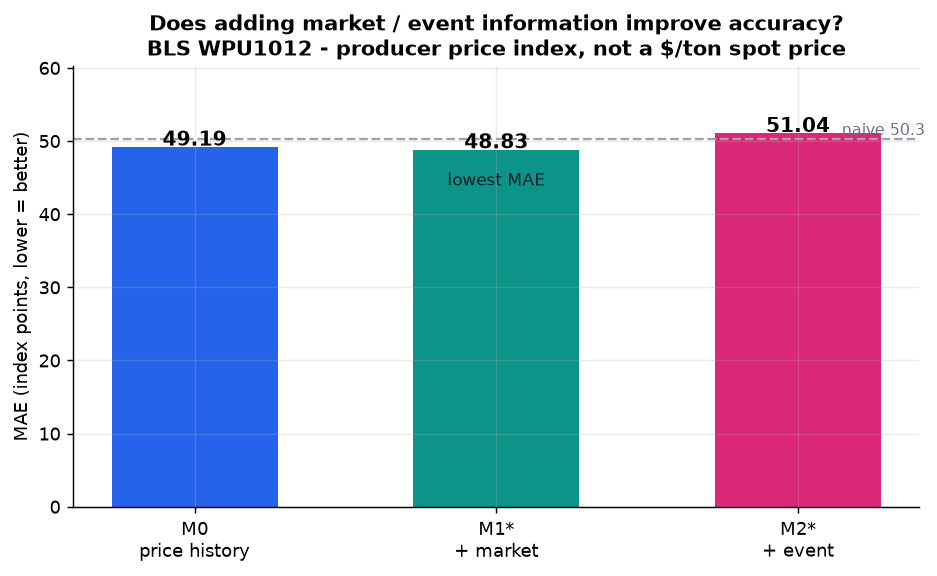
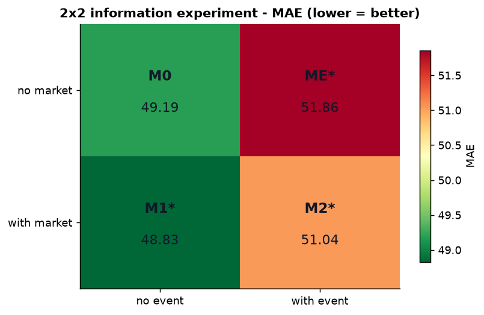
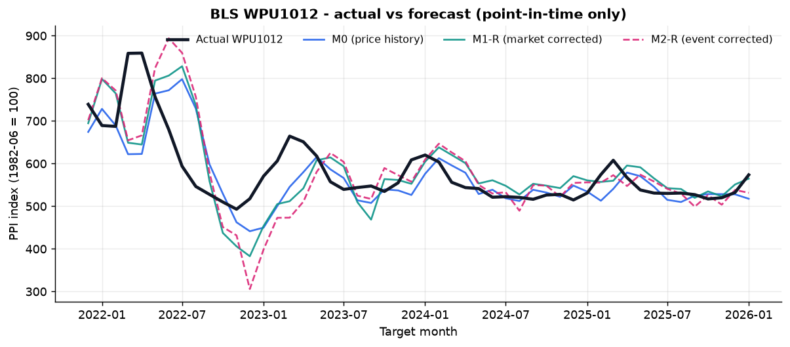
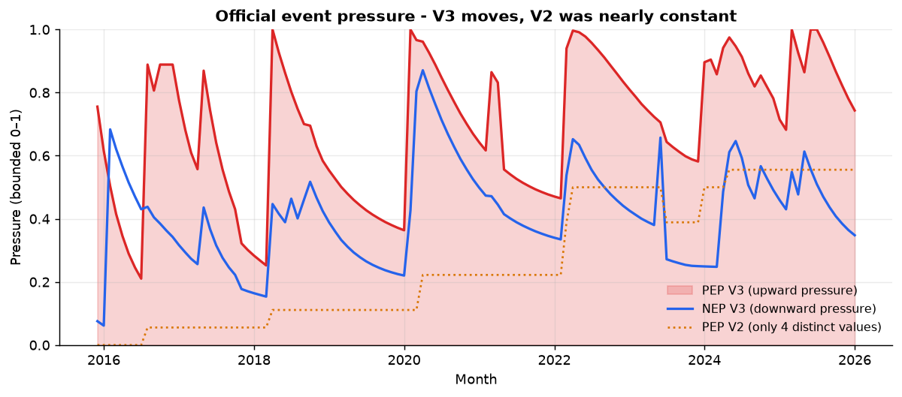
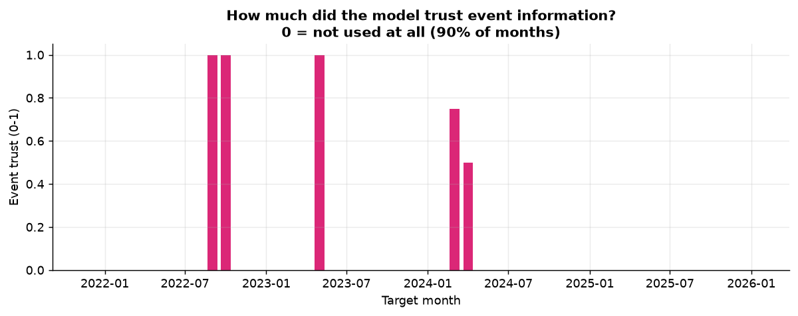
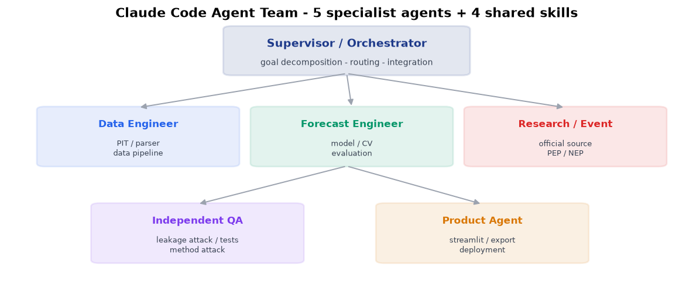

# 미국 철·강 스크랩 생산자물가지수(PPI) 예측 Demo

### Target: **BLS WPU1012** — Iron and steel scrap
*U.S. Iron & Steel Scrap Producer Price Index Forecasting*

> **쉽게 말하면, 미국 철·강 스크랩 시장의 전반적인 생산자 가격 움직임을 보여주는
> BLS 공식 가격지수입니다.**
> 각 과거 시점에 실제로 공개되어 있던 정보만 사용해서 다음 달을 예측했습니다.
> 무료 공개 데이터 · CPU only · 사전등록된 실험.

🎯 **예측 대상은 실제 $/ton 거래가격이 아니라 BLS 공식 생산자물가지수(PPI)입니다.**

---

## 1. 핵심 결과

| 모델 | 의미 | MAE ↓ | 지위 |
|---|---|---|---|
| M0 | 과거 PPI 기반 | 49.19 | 공식 기준 |
| M1* | 시장·산업 정보 추가 | 48.83 | V5 운영 |
| M2* | 공식 Event 정보 추가 | 51.04 | V5 운영 |



**시장·산업 정보를 추가한 M1\*** 가 과거 가격만 쓰는 M0 보다 **+0.7%**
나아졌습니다.

**공식 Event 정보는 이번에도 예측 정확도를 개선하지 못했습니다** — M2\* 는 M1\*
대비 **-4.5%** 입니다. 네 개의 정보 조합 어디에서도, 두 분석 방식 모두에서
개선이 없었습니다.

> **다만 M1\* 의 개선은 통계적으로 유의하지 않습니다.** 잡음 방어 장치를 끈
> **통제 비교**에서는 같은 시장 모델이 MAE **47.14** 로 **+4.2%**
> 개선했습니다 (DM p = 0.075). 두 숫자를 함께 보아야 합니다.

---

## 2. 2×2 정보 실험 — 시장과 Event 는 각각 도움이 되었는가

| MAE ↓ | Event 없음 | Event 있음 |
|---|---|---|
| **Market 없음** | M0 **49.19** | ME* **51.86** |
| **Market 있음** | M1* **48.83** | M2* **51.04** |



- **시장 정보** — 아래로 갈 때 오차가 **줄어듭니다** (49.19 → 48.83)
- **Event 정보** — 오른쪽으로 갈 때 오차가 **늘어납니다**
  (49.19 → 51.86, 48.83 → 51.04)

통제 비교에서 시장 위에 Event 를 얹는 것은 **47.14 → 52.16**
(DM p = 0.019) 로 가장 뚜렷하게 나빠집니다.



---

## 3. 무엇이 M1 을 고쳤는가 — 블록 규제

이전 설계는 **하나의 규제 강도**를 모델 전체에 적용했습니다. 그래서 잡음 많은 시장
변수를 억누르려면 **유용한 가격이력 신호까지 함께 눌러야** 했습니다.

V5 는 가격이력·시장·Event 에 **각각 다른 규제 강도**를 줍니다. 실제로 서로 다른
값이 선택됐습니다 — 가격이력 규제는 1~10,000 까지 분포했지만 시장 규제는
**10~100 에만 머물렀습니다.**

선택된 시장 모델: M0-fallback 20 · M1-C pls4 16 · M1-C pls3 8 · M1-C pls2 4 · M1-B block 1 · M1-D combo w=0.25 1

학습 근거가 부족한 **40%** 의 시점에서는 모델이 시장 정보를 쓰지
않고 가격이력 모델로 되돌아갔습니다.

### 왜 시장 정보가 원래 어려웠나 (실행 전 진단)

| 진단 | 값 |
|---|---|
| 학습행 / feature (최소) | **3.27** |
| 시장 변수 내부 최대 상관 | **0.97** |
| 개별 시장변수를 과거이력으로 설명한 R² (최대) | **0.89** |

---

## 4. 공식 Event 정보 (PEP / NEP)

뉴스 기사 원문을 수집하지 않습니다. **공식적으로 확인된 사건과 상태**를 구조화해
두 개의 압력 변수로 변환합니다.

- **PEP ↑** — 공식 Event 근거상 **가격 상승 압력**이 강해짐 (0~1)
- **NEP ↑** — 공식 Event 근거상 **가격 하락 압력**이 강해짐 (0~1)

감성분석이 아니고 **확률도 아니며**, 두 지표는 **독립**입니다.



### 모델이 Event 를 얼마나 신뢰했는가



**모델은 90% 의 예측시점에서 Event 정보를 쓰지 않기로 스스로
선택했습니다.** V4 에서는 Event 가 모든 시점에서 강제로 사용되어 예측을 크게
흔들었습니다(중앙값 15 지수 Point). V5 의 중앙값 보정폭은 **0.0** 입니다.

그 결과 V4 의 Event 모델(MAE 67.40) 대비 **+24.3%** 나아졌습니다.
다만 이것은 **Event 를 유용하게 만든 것이 아니라 해롭지 않게 만든 것**입니다.

**V5 는 공식 사건 기록을 하나도 바꾸지 않았습니다** — 바꾼 것은 모델이 그 기록을
쓰는 방식뿐입니다.

---

## 5. 어떤 데이터를 쓰나 — 6개 원천지표 → 12개 파생 Feature

```
        6개의 원천지표
              |
     각각  현재 수준 (Level)
        +  최근 3개월 변화 (Momentum)
              |
        12개의 파생 Feature
```

> **12개의 서로 다른 외부 데이터셋이 아닙니다.**

| Series ID | 공식 계열명 | 출처 | 무엇을 측정하나 | 파생 Feature |
|---|---|---|---|---|
| `WPU1017` | PPI: Steel Mill Products | US BLS | 철강 압연제품의 생산자물가지수 | `_level` · `_chg_3m` |
| `WPU0542` | PPI: Electric Power | US BLS | 전력의 생산자물가지수 | `_level` · `_chg_3m` |
| `AWHMAN` | Avg Weekly Hours: Manufacturing | US BLS | 제조업 생산직 주당 평균 근로시간 | `_level` · `_chg_3m` |
| `INDPRO` | Industrial Production: Total | Federal Reserve Board | 미국 전체 산업생산지수 | `_level` · `_chg_3m` |
| `IPG331S` | IP: Primary Metal | Federal Reserve Board | 1차 금속(NAICS 331) 산업생산지수 | `_level` · `_chg_3m` |
| `CAPUTLG331S` | Capacity Utilization: Primary Metal | Federal Reserve Board | 1차 금속(NAICS 331) 설비 가동률 | `_level` · `_chg_3m` |

**이번 단계에서도 새로운 외부 데이터 소스를 추가하지 않았습니다.**

---

## 6. 한눈에 보기

| | |
|---|---|
| 예측 대상 | **BLS WPU1012** (Iron and steel scrap, PPI) |
| 설명변수 | Clean-PIT **6개 원천지표 → 12개 파생 Feature** |
| 예측 시점 | **50개** (2021-11-30 ~ 2025-12-31) |
| 학습 행 | 72 ~ 118 — **모든 모델 동일** |
| 공식 사건 | 사안 **17건** · 상태 변화 **49건** |
| 자동 테스트 | **1290개** |
| FRED/ALFRED 의존 | **0** |
| V5 방법론 동결 | `V5A-2026-08-27` (실행 **전** 커밋) |
| 실행 커밋 | `6e2cc7349e78` |

---

## 7. Claude Code Agent Team



> **한 모델에게 모든 업무를 한 번에 시킨 것이 아니라, 프로젝트를 역할별로 분해하고
> 전문 Agent 가 각 업무를 수행하도록 구성했습니다.**

| Agent | 역할 |
|---|---|
| **Data Engineer** | 과거 발표본 재구성 · PIT 데이터 · 파서 · 소스 QA |
| **Forecast Engineer** | feature 파이프라인 · nested CV · 예측 · 지표 |
| **Research / Event** | 공식 출처 조사 · 사건 상태 코딩 · PEP / NEP |
| **Independent QA** | PIT leakage 공격 · 방법론 검토 · 테스트 검증 |
| **Product Agent** | 대시보드 · public-safe export · 배포 |

작업 흐름: **Research → Implementation → Independent QA → Failure Diagnosis →
Redesign → Dashboard / Deployment**

---

## 8. 대시보드 실행

```bash
pip install -r requirements.txt
streamlit run streamlit_app.py
```

앱은 `data/` 의 사전 계산된 결과만 읽습니다. 외부 API 호출·데이터 수집·모델 학습을
하지 않으므로 연구용 노트북이 꺼져 있어도 동작합니다.

**기본 화면은 M0 / M1\* / M2\* 세 모델만 보여줍니다.** V1~V7 의 모든 중간 실험은
`연구 과정 (Research Archive)` 탭에 **하나도 삭제되지 않고** 보관되어 있습니다.

---

## 9. Event 는 정확도 밖에서도 쓸모가 없었나 (V6 · V7)

정확도 질문의 답이 일관되게 "아니오"였기 때문에, **질문 자체를 두 번 바꿔서** 다시
사전등록했습니다.

**V6 — 예측 역할을 바꾸면?** 방향 · 큰 변동 · 전환점. 세 역할 모두 개선 없음.
다만 이번에 처음으로 **이유**가 보였습니다 — Event 를 포함한 모델만 학습에서 더
좋아 보이고 실제 예측에서 무너지는 격차(+0.07 ~ +0.24)를 냈습니다.

**V7 — 정확도 대신 위험을 물으면?** 네 가지를 사전등록했습니다.

| Track | 질문 | 결과 |
|---|---|---|
| **A (PRIMARY)** | Event 가 **80% 예측구간**을 개선하는가 | **개선** 방향이지만 **지지 안 됨** (Interval Score 258.3 → 229.2, p = 0.318) |
| B | Event 가 **급등·급락 위험**을 감지하는가 | **결론 유보** — 급등 사례 4건으로 표본 부족 (서술적으로는 악화) |
| C | Event 효과가 **시장 상황**에 따라 달라지는가 | **개선** 방향이나 유의하지 않음 (MAE 47.14 → 46.27, p = 0.353) |
| D | **발표 직전 새로 들어온** Event 가 더 유용한가 | **악화** — 유의하게 더 나쁨 (MAE 47.14 → 48.96, p = 0.00005) |

1차 가설에서 더 중요한 발견은 따로 있습니다 — **목표 80% 구간이 실제로는 100% 를
덮었습니다.** 구간이 정확한 것이 아니라 **너무 넓습니다.** 구간 폭이 나오는 과거
오차(2021~22 격변기)가 평가 구간(2023~25)보다 훨씬 격렬했기 때문입니다.

### 사전에 정한 중단 규칙이 발동했습니다

1차 가설 미지지 + 강한 보조 근거 **0건** → **Event 모델 개발을 여기서 멈춥니다.**
V8 을 시작하지 않고, 새 Event feature 도 새 모형도 새 사건 기록도 추가하지
않습니다. 다음 단계는 **더 긴 Point-in-Time 이력 확보**입니다
([계획](docs/next_phase_plan.md) — 계획만, 실행 없음).

V5 의 난수 실험, V6 의 일반화 격차, V7 의 100% 과대커버는 모두 같은 하나를
가리킵니다: **예측 시점 50개라는 표본 크기.**

---

## 10. Event 가 기존 모델의 오판을 뒤집을 수 있나 (V8)

정확도 질문의 답이 아홉 번 아니오였기 때문에, V8 은 질문 대신 **구조**를 바꿨습니다.

먼저 확인한 것이 있습니다 — "예측이 급변과 반대로 움직인다"는 관찰이 **표시 오류인지
동역학인지**. 50개 예측시점 × 7가지 검사를 **전부 통과**했습니다(문제 0건).
표시 오류가 아니라 동역학이 문제였습니다.

그래서 **가격이력에 종속되지 않은** 독립 모델을 만들고, 평상에는 기존 모델을 쓰다가
**급변 의심 구간에서만 Event 가 문을 열어** 독립 전문가로 갈아타게 했습니다.

| 결과 | |
|---|---|
| Event 게이트가 열린 시점 | **0 / 50** — 한 번도 열리지 않았다 |
| 실제 급변 + Event 신호가 있던 달의 평균 열림 | **0.140** ← 가장 낮다 |
| Event 만 쓴 모델의 급변 방향 적중 | **0.000** (8개월 전부 오답) |
| 시장만 독립 모델 | 구제 13건 vs **잘못된 뒤집기 14건** |
| Event 게이트 MAE | 46.76 (M1\* 48.83) |

**게이트는 진짜 급변이 왔을 때 오히려 덜 열렸습니다.** 약하게 역방향인 탐지기입니다.
이유는 모델이 스스로 말해 줍니다 — 게이트는 50개 시점 중 **44개에서 가장 강한 규제**를
골랐습니다. 내부 검증이 *"변동시키지 말고 평균을 예측하라"* 고 판정한 것입니다.

MAE 는 낮아졌지만 **과장하지 않습니다.** 게이트가 사실상 상수(약 0.20)이므로 이것은
regime 전환이 아니라 **고정 가중 앙상블**이며, 개선의 대부분이 평상 구간에서
나옵니다. **충격 구제를 목표로 만든 구조가, 정작 충격에서는 작동하지 않았습니다.**

### Data Scientist Challenge

에이전트 제안 3건 중 **독립 QA 가 1건만 승인**했고, 승인된 그 1건조차 **데이터가
스스로 거절**했습니다(50개 중 49개에서 "재보정하지 않음" 선택).

QA 는 제안서의 사실 주장을 하나도 믿지 않고 전부 원본에서 재확인해 **8건이 틀렸음**을
찾아냈습니다. 그중 둘이 결정적이었습니다 — 주장된 안전장치가 **실제로는 존재하지
않았고**, 추정된 계수는 **음수**였습니다. 원안대로 실행했다면 대부분의 예측시점에서
기존 모델의 방향 판단을 강제로 뒤집었을 것입니다. **독립 QA 가 결과를 바꾼 사례입니다.**

### 데이터 규칙은 성능보다 우선합니다

18개 소스를 판정해 **통과 8 · 보류 5 · 배제 5**. 보류는 모델링에서 배제와 동일하게
취급합니다. **V8 모델링에 쓴 4종은 전부 통과 등급이며 새로 들어간 소스는 0건**입니다.
상업 스크랩 가격 피드처럼 성능에 도움이 될 수 있는 것도 규칙대로 배제했습니다.

> V8 결과는 **탐색적 구조 연구**입니다. 가설이 이미 관측된 구간에서 나왔으므로
> 같은 구간의 결과는 새로운 확증 근거가 아닙니다.
> ([상세](docs/findings_v8.md) · [데이터 확장 타당성](docs/data_expansion_v8.md))

## 문서

- [경영진 요약](docs/executive_summary.md)
- [방법론 요약](docs/methodology_summary.md)
- [Demo V8 결과와 해석](docs/findings_v8.md)
- [V8 데이터 확장 타당성](docs/data_expansion_v8.md)
- [Demo V7 결과와 해석](docs/findings_v7.md)
- [다음 단계 계획 — 더 긴 PIT 이력](docs/next_phase_plan.md)
- [Demo V6 결과와 해석](docs/findings_v6.md)
- [Demo V5 결과와 해석](docs/findings_v5.md)
- [Demo V4 결과와 해석](docs/findings_v4.md)
- [Demo V3 결과와 해석](docs/findings_v3.md)
- [사건 압력 방법론 V3](docs/event_method_v3.md)
- [사건 압력 방법론 V2 (보존)](docs/event_method.md)
- [배포 보안 감사](docs/DEPLOYMENT_AUDIT.md)

---

## 11. 한계 (경영진 보고 시 함께 전달)

- 예측 시점 50개로 검정력이 제한적입니다. **"유의하지 않음"과 "효과 없음"은 다릅니다.**
- Clean-PIT 대상 패널의 관측월이 137개뿐이라 학습 구간이 짧습니다 (학습행 72~118).
- **모델 선택 자체가 과적합의 주된 원천입니다.** 예측 대상과 아무 관계 없는 난수조차
  내부 검증 오차를 중앙값 1.6%(시장) / 5.6%(Event) '개선'했습니다.
  그래서 **12% 문턱**을 두었고, 그 문턱이 다시 진짜 시장 신호도 일부 막았습니다.
- 설명변수가 미국 공급·산업활동 축에 치우쳐 있고, 원자재 가격·전방 수요·환율 축이 비어 있습니다.
- Event 채널별 유용성은 **판별할 수 없습니다** — 두 채널은 평가 구간 내내 활성이고
  나머지 하나는 2개월만 활성입니다.
- M1\*/ME\*/M2\* 는 **탐색적 확장**이며 정식 사전등록 결과가 아닙니다.
- **가장 큰 남은 제약은 표본 크기입니다.** 새 변수나 새 모델이 아니라 **더 긴
  Point-in-Time 이력**이 근본 제약입니다.
- 이 Demo는 **공개 지수** 예측이며 특정 기업의 구매가격 예측이 아닙니다.
