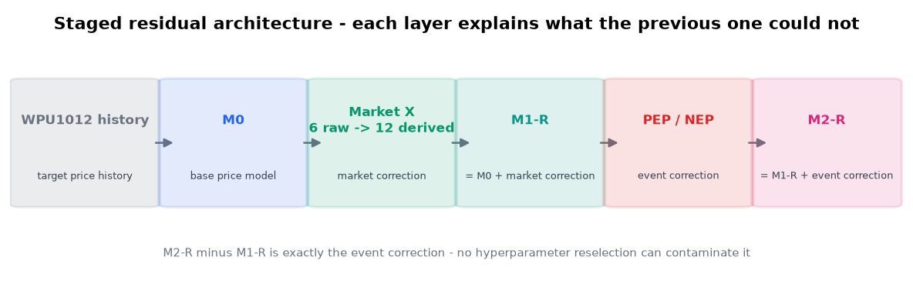
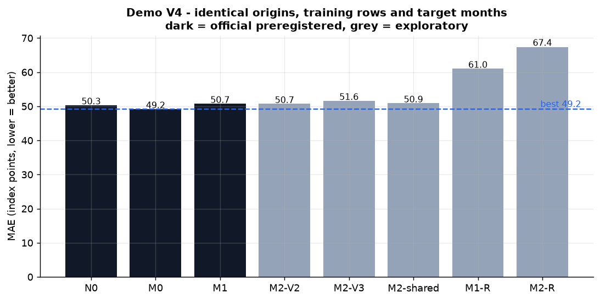
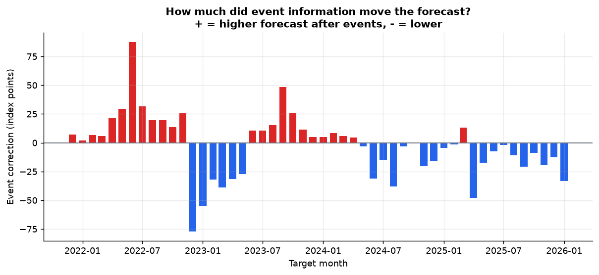

# 미국 철·강 스크랩 생산자물가지수(PPI) 예측 Demo

### Target: **BLS WPU1012** — Iron and steel scrap
*U.S. Iron & Steel Scrap Producer Price Index Forecasting*

> **쉽게 말하면, 미국 철·강 스크랩 시장의 전반적인 생산자 가격 움직임을 보여주는
> BLS 공식 가격지수입니다.**
> 각 과거 시점에 실제로 공개되어 있던 정보만 사용해서 다음 달을 예측했습니다.
> 무료 공개 데이터 · CPU only · 사전등록된 실험.

🎯 **예측 대상은 실제 $/ton 거래가격이 아니라 BLS 공식 생산자물가지수(PPI)입니다.**

---

## 1. 무엇을 예측하나

**미국에서 철스크랩이 지난달보다 비싸졌는지 싸졌는지를, 다음 달에 대해 미리 맞혀보는
것입니다.**

미국 노동통계국(BLS)이 매달 발표하는 숫자 하나(`WPU1012`)가 그 대상입니다.
이 숫자는 **가격표가 아니라 가격의 온도계**입니다.

### 지수를 읽는 법

| 방향 | 의미 |
|---|---|
| 지수 상승 ↑ | 전반적인 미국 철·강 스크랩 **생산자 가격 수준 상승** 방향 |
| 지수 하락 ↓ | 전반적인 **생산자 가격 수준 하락** 방향 |

> **지수 600 ≠ $600/ton 입니다.**
> 예: 500 → 550 은 **약 10% 지수 상승**이지 **$50/ton 상승이 아닙니다.**
> 지수 차이는 항상 **변화율**로 읽습니다.

### 무엇이 아닌가

| 아닌 것 | 이유 |
|---|---|
| 특정 기업의 **구매가격** | 미국 생산자 단계 전체의 공식 통계입니다 |
| 특정 grade(HMS 80:20 등)의 **거래가격** | 여러 스크랩 제품군을 묶은 지수입니다 |
| **$/ton 현물 시세** | 달러 금액이 아니라 기준시점 대비 배율입니다 |
| **한국 내수 가격** | 미국 시장 기준 통계입니다 |

---

## 2. 어떤 데이터를 쓰나 — 6개의 원천지표 → 12개의 파생 Feature

```
        6개의 원천지표
              |
     각각  현재 수준 (Level)
        +  최근 3개월 변화 (Momentum)
              |
        12개의 파생 Feature
```

> **12개의 서로 다른 외부 데이터셋이 아닙니다.**
> 6개의 검증된 원천지표에서 2개 형태의 feature 를 생성했습니다.

| Series ID | 공식 계열명 | 출처 | 무엇을 측정하나 | 파생 Feature |
|---|---|---|---|---|
| `WPU1017` | PPI: Steel Mill Products | US BLS | 철강 압연제품의 생산자물가지수 | `_level` · `_chg_3m` |
| `WPU0542` | PPI: Electric Power | US BLS | 전력의 생산자물가지수 | `_level` · `_chg_3m` |
| `AWHMAN` | Avg Weekly Hours: Manufacturing | US BLS | 제조업 생산직 주당 평균 근로시간 | `_level` · `_chg_3m` |
| `INDPRO` | Industrial Production: Total | Federal Reserve Board | 미국 전체 산업생산지수 | `_level` · `_chg_3m` |
| `IPG331S` | IP: Primary Metal | Federal Reserve Board | 1차 금속(NAICS 331) 산업생산지수 | `_level` · `_chg_3m` |
| `CAPUTLG331S` | Capacity Utilization: Primary Metal | Federal Reserve Board | 1차 금속(NAICS 331) 설비 가동률 | `_level` · `_chg_3m` |

각 지표가 스크랩 PPI 와 관련될 수 있는 **가능한 경로**는 대시보드의
`어떤 데이터를 쓰나` 탭과 [`data/x_feature_registry.csv`](data/x_feature_registry.csv)
에 있습니다. **인과관계 주장이 아닙니다.**

### 왜 이 6개인가

단순히 상관이 높은 변수를 넣은 것이 아닙니다. Primary 모델에는 다음을 **모두**
만족한 Clean-PIT 계열만 사용했습니다.

- **원기관 원문 출처** — 재배포 플랫폼이 아니라 BLS · Federal Reserve 원문
- **충분한 과거 커버리지** · **Point-in-Time 재구성 가능** · **발표일 검증**
- **개정(revision) 처리** · **매월 재현 가능** · **공개 배포 안전성**

소비자물가(CPIAUCSL)는 과거 구간 robustness 검증용으로만 재구성했고, 공식 경로로
매월 갱신이 불가능해 primary 에서 제외했습니다 — 사유는 **예측 성능이 아니라 운영
재현성**입니다.

> **이번 단계에서 새로운 외부 데이터 소스를 추가하지 않았습니다.**
> 환율 · 달러지수 · 철광석 · 열연 · 해상운임 등은 저작권/이용약관 범위와 기존 비교
> 가능성을 유지하기 위해 future work 로 남겼습니다.

---

## 3. 한눈에 보기

| | |
|---|---|
| 예측 대상 | **BLS WPU1012** (Iron and steel scrap, PPI) |
| 설명변수 | Clean-PIT **6개 원천지표 → 12개 파생 Feature** |
| 예측 시점 | **50개** (2021-11-30 ~ 2025-12-31) |
| 학습 행 | 72 ~ 118 — **모든 단계 동일** |
| 공식 사건 | 사안 **17건** · 상태 변화 **49건** |
| 자동 테스트 | **843개** |
| FRED/ALFRED 의존 | **0** |
| V4 방법론 동결 | `V4A-2026-08-26` (실행 **전** 커밋) |
| 실행 커밋 | `d10b8a89ef95` |

---

## 4. 모델 구조 — V4 Staged Residual



```
              WPU1012 이력
                    |
                   M0                 가격 자체가 가진 정보
                    |
             설명 못한 부분
                    |
      기존 시장 X (6 raw -> 12 derived)
                    |
            Market correction
                    |
                  M1-R                시장·산업 정보가 추가로 설명한 부분
                    |
             설명 못한 부분
                    |
               PEP / NEP
                    |
             Event correction
                    |
                  M2-R                공식 Event 정보가 추가로 설명한 부분
```

**핵심 성질:** `M2-R − M1-R` 은 **정의상 정확히 Event 보정폭**입니다.
이전(V3)처럼 변수를 추가하는 순간 규제 강도가 재선택되고 전체 계수가 다시 적합되어
효과가 섞이는 일이 **구조적으로 일어날 수 없습니다.**

---

## 5. 결과 — 동일 Train/Test (50개 예측 시점)

| 모델 | 의미 | MAE ↓ | 지위 |
|---|---|---|---|
| N0 | 직전 가용치 그대로 | 50.32 | 공식 |
| M0 | 과거 PPI 기반 | 49.19 | 공식 |
| M1 | 시장·산업 정보 추가 | 50.75 | 공식 |
| M2-V2 | 공식 Event 확장 V2 | 50.72 | 탐색 |
| M2-V3 | Event 표현 고도화 V3 | 51.61 | 탐색 |
| M1-shared | 동일 규제 시장정보 | 50.75 | 진단 |
| M2-shared | 동일 규제 + Event | 50.90 | 진단 |
| M1-R | 시장정보 보정 모델 | 60.99 | 탐색 |
| M2-R | Event 정보 보정 모델 | 67.40 | 탐색 |



> **결과를 그대로 보고합니다.** 시장 정보를 더한 M1 도, 공식 사건 정보를 더한 M2
> 계열도, 단계 보정 구조의 M1-R·M2-R 도 **M0 를 개선하지 못했습니다.**
> 이 조건에서 가장 정확한 것은 여전히 과거 PPI 이력만 쓰는 **M0** 입니다.


---

## 6. 이번 단계에서 실제로 얻은 것

목표는 정확도 개선이 아니라 **"공식 Event 정보의 효과를 다른 효과와 분리해서 재는
것"** 이었습니다. 두 가지를 얻었습니다.

### 6-1. V3 에서 관측된 악화의 대부분은 Event 정보가 아니었습니다

규제 강도를 **M1 이 고른 값으로 고정**한 채 Event 변수만 추가하면:

| | M1 대비 MAE 변화 |
|---|---|
| M2-V3 (V3 · 규제 재선택 허용) | **+0.865** |
| M2-shared (규제 고정) | **+0.149** |

→ V3 악화의 약 **83%** 는 Event 정보가 아니라 **규제 강도 재선택과
전체 계수 재적합** 때문이었습니다.

### 6-2. Event 정보는 이제 예측을 크게 움직입니다 — 그러나 방향이 맞지 않습니다



| 항목 | 값 |
|---|---|
| median Event 보정폭 | **15.17** 지수 Point |
| 보정 방향이 실제로 맞은 비율 | **54%** |
| MAE 변화 (M1-R → M2-R) | **+6.41** |

joint Ridge 안에서 사실상 침묵하던 신호가 단계 구조에서는 실제로 크게 움직였습니다.
그러나 방향 적중률이 동전 던지기와 구분되지 않는데 보정 크기만 크면, 그것은
**분산 주입**입니다. **움직임의 크기와 정확도는 다른 문제입니다.**

선택 분포 — Event 표현: E1 22 · E2 20 · E0 8 · Event 보정 모델: ridge 27 · huber 14 · ols 9

---

## 7. 왜 시장 정보를 더해도 좋아지지 않았나 (실행 전 진단)

성능을 보기 **전에** 학습 데이터만으로 측정한 값입니다.

| 진단 | 값 |
|---|---|
| 학습행 / feature (M1, 최소) | **3.27** |
| 시장 X 내부 최대 상관 | **0.97** |
| 개별 X 를 과거이력으로 설명한 R² (최대) | **0.89** |
| 같은 예측 기여에 PEP 가 필요로 한 계수 배수 | **4.6×** |
| 그에 따른 규제 벌점 배수 | **21×** |

시장 X 는 (a) 상당 부분이 **이미 가격 이력에 들어 있고**, (b) **자기들끼리 강하게
겹치며**, (c) 표본 대비 차원을 늘려 **모델 전체의 규제를 강화**시킵니다.

압력 변수(PEP/NEP)는 유계 [0,1] 이라 표준화하지 않으므로 같은 예측 기여를 만들려면
훨씬 큰 계수가 필요하고, 규제 벌점은 계수의 제곱이므로 수십 배를 치릅니다.
**이것이 V3 까지 Event 신호가 눌려 있던 구조적 이유입니다 — 추측이 아니라 측정값입니다.**

---

## 8. 공식 사건 압력 (PEP / NEP)

뉴스 기사 원문을 수집하지 않습니다. **공식적으로 확인된 사건과 상태**를 구조화해
두 개의 압력 변수로 변환합니다.

- **PEP ↑** — 공식 Event 근거상 **가격 상승 압력**이 강해짐 (0~1)
- **NEP ↑** — 공식 Event 근거상 **가격 하락 압력**이 강해짐 (0~1)
- 둘 다 높음 = 상충 환경 · 둘 다 낮음 = 조용한 Event 환경

감성분석이 아니고 **확률도 아니며**, 두 지표는 **독립**입니다.


출처: U.S. Federal Register · U.S. Department of the Treasury · U.S. Department of
Defense · U.S. Department of Commerce · U.S. Department of Energy · U.S. Department
of Transportation · U.S. CDC. 전체 목록과 링크는
[`data/event_transition_registry_v3.csv`](data/event_transition_registry_v3.csv),
방법론은 [`docs/event_method_v3.md`](docs/event_method_v3.md).

**"위협"과 "실행"을 구분합니다.** 공식 문서로 확인되지 않는 것은 기록하지 않았습니다.
**V4 는 이 정의를 하나도 바꾸지 않았습니다** — 바꾼 것은 모델이 그 표현을 쓰는
방식뿐입니다.

---

## 9. 왜 Clean-PIT 인가

**2023년 시점을 예측할 때 2026년에 수정된 최종 WPU1012 값을 사용하는 것이 아니라,
당시 실제로 공개되어 있던 값만 사용합니다.**

```
forecast origin O 에서 사용 가능한 값
  = release_date <= O 인 발표분 중 가장 최근 값
```

사건 정보에도 같은 규칙을 적용합니다. 각 사건은 **인용한 공식 문서가 공개된 날짜**로
기록되며, 평가 구간 종료 이후에 처음 알려진 정보는 로더가 **거부**합니다.

### V4 가 추가로 지킨 규칙 — Prequential 잔차

보정 층이 학습하는 '설명되지 않은 부분'도 **그 시점에 실제로 관측 가능했어야**
합니다. 그래서 각 예측 시점의 학습 구간 **안에서 다시** 앞→뒤 순서로 적합·예측을
반복해 잔차를 만들었습니다. 전처리도 매번 그 구간에서만 적합합니다.
**자동 테스트가 이 성질을 강제합니다** — 뒤쪽 데이터를 바꿔도 앞쪽 잔차가 변하지
않아야 통과합니다.

---

## 10. Claude Code Agent Team


> **한 모델에게 모든 업무를 한 번에 시킨 것이 아니라, 프로젝트를 역할별로 분해하고
> 전문 Agent 가 각 업무를 수행하도록 구성했습니다.**

| Agent | 역할 |
|---|---|
| **Data Engineer** | 과거 발표본 재구성 · PIT 데이터 · 파서 · 소스 QA |
| **Forecast Engineer** | feature 파이프라인 · nested CV · 예측 · 지표 |
| **Research / Event** | 공식 출처 조사 · 사건 상태 코딩 · PEP / NEP |
| **Independent QA** | PIT leakage 공격 · 방법론 검토 · 테스트 검증 |
| **Product Agent** | 대시보드 · public-safe export · 배포 |

공유 Skill 로 원칙을 강제합니다 — `pit-data-contract`(누수 방지) ·
`ts-backtest-protocol`(평가 규격) · `zero-cost-guard`($0 · CPU-only) ·
`steel-forecast-orchestrator`(진행 규율).

작업 흐름: **Research → Implementation → Independent QA → Failure Diagnosis →
Redesign → Dashboard / Deployment**

---

## 11. 대시보드 실행

```bash
pip install -r requirements.txt
streamlit run streamlit_app.py
```

앱은 `data/` 의 사전 계산된 결과만 읽습니다. 외부 API 호출·데이터 수집·모델 학습을
하지 않으므로 연구용 노트북이 꺼져 있어도 동작합니다.

## 문서

- [경영진 요약](docs/executive_summary.md)
- [방법론 요약](docs/methodology_summary.md)
- [Demo V4 결과와 해석](docs/findings_v4.md)
- [사건 압력 방법론 V3](docs/event_method_v3.md)
- [Demo V3 결과와 해석](docs/findings_v3.md)
- [사건 압력 방법론 V2 (보존)](docs/event_method.md)
- [배포 보안 감사](docs/DEPLOYMENT_AUDIT.md)

---

## 12. 한계 (경영진 보고 시 함께 전달)

- 예측 시점 50개로 검정력이 제한적입니다. **"유의하지 않음"과 "효과 없음"은 다릅니다.**
- Clean-PIT 대상 패널의 관측월이 137개뿐이라 학습 구간이 짧습니다 (학습행 72~118).
- 설명변수가 미국 공급·산업활동 축에 치우쳐 있고, 원자재 가격·전방 수요·환율 축이 비어 있습니다.
- 사건 압력(M2)과 단계 보정(M1-R/M2-R)은 **탐색적 확장**이며 정식 사전등록 결과가 아닙니다.
- Prequential 잔차 규칙은 누수를 막지만, 보정 층이 **더 짧은 구간으로 학습된 약한 모델**의
  잔차를 배우게 만듭니다. V4 의 정확도 악화는 상당 부분 이 불일치에서 왔습니다.
- **가장 큰 남은 제약은 표본 크기입니다.** 이 규모에서는 층을 하나 더 쌓을 때 생기는
  추정 분산이 어떤 신호 이득보다 큽니다. 새 변수나 새 모델이 아니라 **더 긴 PIT 이력**이
  근본 제약입니다.
- 이 Demo는 **공개 지수** 예측이며 특정 기업의 구매가격 예측이 아닙니다.
