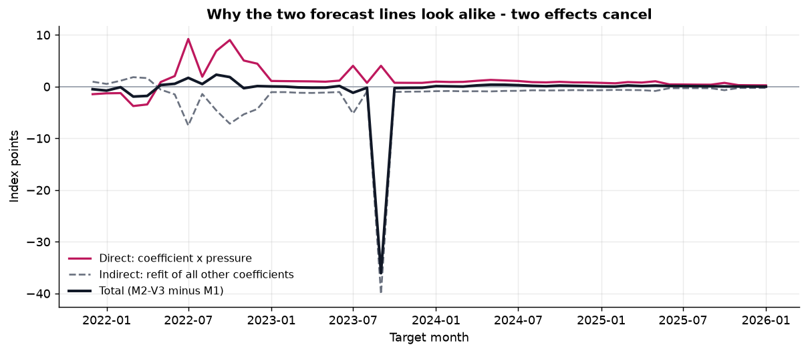

# 미국 철·강 스크랩 생산자물가지수(PPI) 예측 Demo

### Target: **BLS WPU1012** — Iron and steel scrap
*U.S. Iron & Steel Scrap Producer Price Index Forecasting*

> **각 과거 시점에 실제로 공개되어 있던 정보만 사용해서 예측했습니다.**
> 무료 공개 데이터 · CPU only · 사전등록된 실험.

🎯 **예측 대상은 실제 $/ton 거래가격이 아니라 BLS 공식 생산자물가지수(PPI)입니다.**

---

## 무엇을 예측하나 — 한 문장으로

**미국에서 철스크랩이 지난달보다 비싸졌는지 싸졌는지를, 다음 달에 대해 미리 맞혀보는
것입니다.**

미국 노동통계국(BLS)이 매달 발표하는 숫자 하나(`WPU1012`)가 그 대상입니다.
이 숫자는 **가격표가 아니라 가격의 온도계**입니다.

### 가장 흔한 오해부터

> **지수 600 = 톤당 600달러가 아닙니다.**

소비자물가지수와 같은 원리입니다. 기준시점(1982년 6월)의 가격을 **100** 으로 놓고,
그 뒤로 가격이 몇 배가 됐는지를 표시한 것입니다.

### 읽는 법

| | 지수 | 읽는 법 |
|---|---|---|
| 어느 달 | 570 | — |
| 그 다음 달 | 600 | **한 달 새 5.3% 올랐다** |

`(600 − 570) ÷ 570 = +5.3%` — 지수는 항상 **변화율**로 읽습니다.

### 무엇이 아닌가

| 아닌 것 | 이유 |
|---|---|
| 특정 기업의 **구매가격** | 미국 생산자 단계 전체의 공식 통계입니다 |
| 특정 grade(HMS 80:20 등)의 **거래가격** | 여러 스크랩 제품군을 묶은 지수입니다 |
| **$/ton 현물 시세** | 달러 금액이 아니라 기준시점 대비 배율입니다 |
| **한국 내수 가격** | 미국 시장 기준 통계입니다 |

### 왜 하필 이 지수인가

무료로 공개되고, **발표 이력이 그대로 보존되며**, 누구나 같은 원문을 다시 확인할 수
있기 때문입니다. 실제 $/ton 거래가격은 대부분 유료 구독입니다. 이 프로젝트는
**비용 0원 · 공개 데이터만** 이라는 조건에서 만들어졌으므로 **결과를 누구나 처음부터
재현할 수 있습니다.**

---

## 한눈에 보기

| | |
|---|---|
| 예측 대상 | **BLS WPU1012** (Iron and steel scrap, PPI) |
| 설명변수 | Clean-PIT 6개 계열 → 12개 파생 지표 |
| 예측 시점 | **50개** (2021-11-30 ~ 2025-12-31) |
| 학습 행 | 72 ~ 118 — **모든 단계 동일** |
| 공식 사건 | 사안 **17건** · 상태 변화 **49건** (2015-06~) |
| 자동 테스트 | **772개** |
| FRED/ALFRED 의존 | **0** |
| 실행 커밋 | `6c34fcec308a` |

---

## 모델 단계 구조


| 단계 | 입력 |
|---|---|
| **M0** | 과거 PPI 이력 10개 |
| **M1** | M0 + 시장/산업 데이터 12개 |
| **M2-V2** | M1 + 공식 사건 압력 2개 (**V2 정의**) |
| **M2-V3** | M1 + 공식 사건 압력 2개 (**V3 정의**) |

**M0/M1 은 기존 사전등록 실험의 단계이며, M2 는 공식 사건 정보를 추가한 탐색적
확장입니다.** M2-V2 와 M2-V3 는 **변수 개수가 2개로 같습니다** — 차이는 개수가 아니라
정의입니다.

---

## Demo V3 결과 — 동일 Train/Test

두 가지 비교 방식을 함께 제시합니다.

- **A. 통제 비교** — 알고리즘을 Ridge로 고정하고 **정보만** 추가
- **B. Best-CV 벤치마크** — 각 예측시점의 **학습 데이터 안에서만** 모델 선택
  (Ridge / ElasticNet / RandomForest / HistGradientBoosting). **V3 에서 새 모델 계열을
  추가하지 않았습니다.**

| 단계 | A. Ridge 고정 MAE | B. Best-CV MAE |
|---|---|---|
| M0 | 49.19 | 47.73 |
| M1 | 50.75 | 49.28 |
| M2-V2 | 50.72 | — |
| M2-V3 | 51.61 | 49.75 |

> **결과를 그대로 보고합니다.** 사건 압력을 더한 M2 는 M1 을 개선하지 못했고, M1 역시
> M0 를 개선하지 못했습니다. 이 조건에서 가장 정확한 것은 여전히 **M0** 입니다.
> 어느 비교도 통계적으로 유의하지 않습니다.

선택된 모델 분포: M0:elasticnet 25 · M0:ridge 25 · M1:elasticnet 21 · M1:ridge 29 · M2_V3:elasticnet 21 · M2_V3:ridge 29


---

## 이번 단계의 목표는 정확도 개선이 아니었습니다

공식 사건을 합리적인 경제적 압력 신호로 표현하고, **그 신호가 모델 안에서 실제로
무슨 일을 하는지 검증**하는 것이 목표였습니다.

### 1. 신호는 신호가 되었습니다

| | V2 | **V3** |
|---|---|---|
| 예측 시점 전체에서 PEP 의 서로 다른 값 | **4** | **48** |
| 사건 기록 | 17 (평평한 목록) | **사안 17 + 상태 변화 49** |
| 최초 기록 | 2016-07 | **2015-06** |

초기 무신호 구간은 **없는 사건을 만들어서가 아니라** 2015년 하반기 미국 철강 무역구제
조사를 새로 찾아서 메워졌습니다. 전부 Federal Register 원문입니다.

### 2. "두 예측선이 겹쳐 보인다"의 진짜 이유

`M2 − M1` 은 **두 경로가 섞인 값**입니다.

```
직접  =  M2 예측  −  M2 예측(사건 변수를 0 으로)     ← 계수 × 압력
간접  =  M2 예측(사건=0)  −  M1 예측                 ← 나머지 계수 재적합
```

같은 학습행에 변수가 2개 늘면 모델은 나머지 모든 계수를 다시 적합합니다.

**V2 에서 두 선이 겹쳐 보인 이유는 아무 일도 없어서가 아니라, 크기가 비슷한 두 효과가
서로 상쇄됐기 때문입니다.** V3 의 최대 변화(2023-09, -36.08 지수 포인트)
조차 직접 효과는 +4.03 뿐이고 나머지 -40.11 는 재적합에서
나왔습니다.



따라서 **현재 설계에서는 "M2 vs M1" 비교 자체가 교란되어 있습니다.** 다음 사전등록에서
정규화 강도를 단계 간에 고정해 이 교란을 제거합니다.

---

## 기존 사전등록 결과 (원본 보존)

결과를 보기 **전에** 규칙을 고정한 실험의 원본 결과입니다. Demo V2·V3 는 이를 대체하지
않습니다.

| 모델 | MAE | RMSE |
|---|---|---|
| N0 | 50.32 | 69.40 |
| M0 | 49.19 | 76.20 |
| M1 | 50.75 | 80.77 |

사전등록된 주요 가설(M0 vs M1): 상대 개선 **-3.2%**, DM 검정 p = **0.727** —
개선 증거 없음. 결과가 기대와 달랐지만 사전에 고정한 모델·기간·지표를 바꾸지
않았습니다.

---

## 공식 사건 압력 (PEP / NEP)

뉴스 기사 원문을 수집하지 않습니다. **공식적으로 확인된 사건과 상태**를 구조화해
두 개의 압력 변수로 변환합니다.

- **PEP** — 가격 **상승** 압력 증거 (0~1)
- **NEP** — 가격 **하락** 압력 증거 (0~1)

감성분석이 아니며 두 지표는 **독립**입니다. 관세처럼 상승·하락 채널을 동시에 갖는
사건은 두 값이 함께 올라갑니다.

V3 는 사건을 **사안(episode) + 상태 변화(transition)** 두 층으로 기록하고, 각 상태를
직접성·범위·확실성으로 채점한 뒤 시간이 지나면 감쇠시킵니다 — **8년째 유지 중인
관세는 압력이 아니라 baseline** 이기 때문입니다.


출처: U.S. Federal Register · U.S. Department of the Treasury · U.S. Department of
Defense · U.S. Department of Commerce · U.S. Department of Energy · U.S. Department
of Transportation · U.S. CDC. 전체 목록과 링크는
[`data/event_transition_registry_v3.csv`](data/event_transition_registry_v3.csv),
방법론은 [`docs/event_method_v3.md`](docs/event_method_v3.md).

**"위협"과 "실행"을 구분합니다.** "해협을 봉쇄하겠다는 위협"과 "해협이 실제로 봉쇄됨"은
다른 사건입니다. 공식 문서로 확인되지 않는 것은 기록하지 않았습니다.

---

## 왜 Clean-PIT 인가

**2023년 시점을 예측할 때 2026년에 수정된 최종 WPU1012 값을 사용하는 것이 아니라,
당시 실제로 공개되어 있던 값만 사용합니다.**

경제지표는 최초 발표 후 여러 차례 개정됩니다. 개정된 값으로 과거를 학습하면 실제
운영에서는 재현되지 않는 성능이 나옵니다.

```
forecast origin O 에서 사용 가능한 값
  = release_date <= O 인 발표분 중 가장 최근 값
```

사건 정보에도 같은 규칙을 적용합니다. 각 사건은 **인용한 공식 문서가 공개된 날짜**로
기록되며, 평가 구간 종료 이후에 처음 알려진 정보는 로더가 **거부**합니다.

---

## Claude Code Agent Team


> 역할별 Agent Team 을 구성해 복잡한 프로젝트를 End-to-End 로 수행했습니다.
> 연구자가 연구 원칙과 판단 기준을 정의하고, Agent Team 이 조사·구현·검증·문서화를
> 수행했습니다.

---

## 대시보드 실행

```bash
pip install -r requirements.txt
streamlit run streamlit_app.py
```

앱은 `data/` 의 사전 계산된 결과만 읽습니다. 외부 API 호출·데이터 수집·모델 학습을
하지 않으므로 연구용 노트북이 꺼져 있어도 동작합니다.

## 문서

- [경영진 요약](docs/executive_summary.md)
- [방법론 요약](docs/methodology_summary.md)
- [사건 압력 방법론 V3](docs/event_method_v3.md)
- [Demo V3 결과와 해석](docs/findings_v3.md)
- [사건 압력 방법론 V2 (보존)](docs/event_method.md)
- [배포 보안 감사](docs/DEPLOYMENT_AUDIT.md)

---

## 한계 (경영진 보고 시 함께 전달)

- 예측 시점 50개로 검정력이 제한적입니다. **"유의하지 않음"과 "효과 없음"은 다릅니다.**
- Clean-PIT 대상 패널의 관측월이 137개뿐이라 학습 구간이 짧습니다.
- 설명변수가 미국 공급·산업활동 축에 치우쳐 있고, 원자재 가격·전방 수요·환율 축이 비어 있습니다.
- 사건 압력(M2)은 **탐색적 확장**이며 정식 연구 검증 대상이 아닙니다.
- 현재 설계에서 "M2 vs M1" 차이에는 계수 재적합 효과가 섞여 있습니다. 이를 제거하는
  설계를 다음 사전등록에서 다룹니다.
- 이 Demo는 **공개 지수** 예측이며 특정 기업의 구매가격 예측이 아닙니다.
